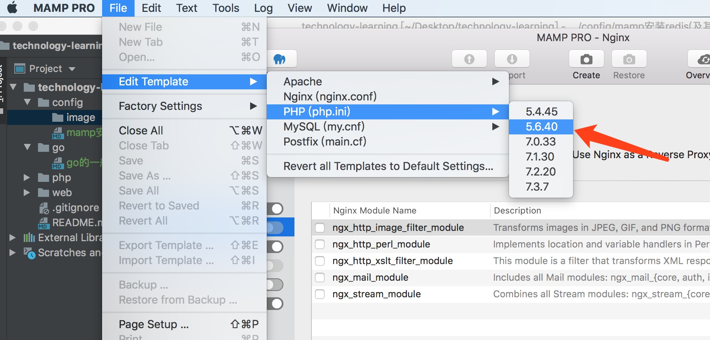
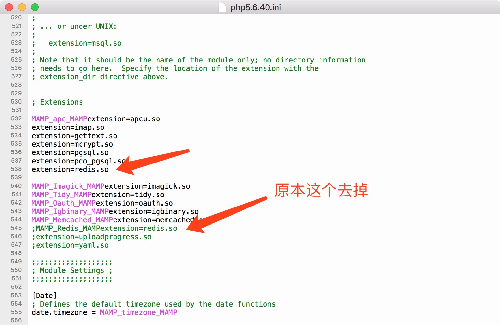
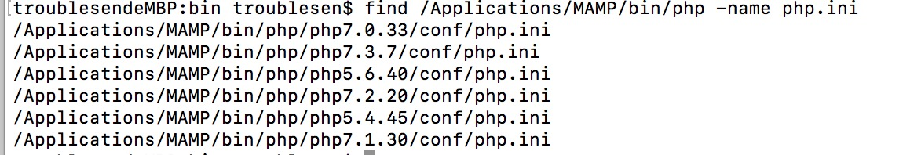
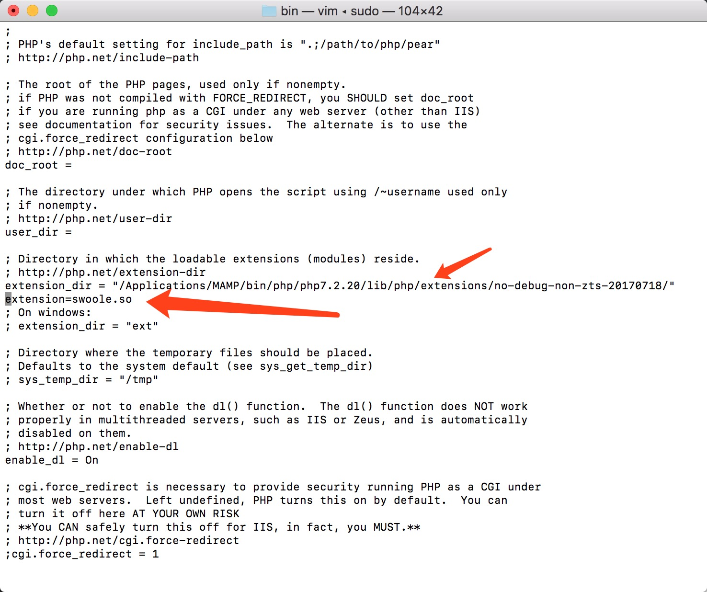

## mamp安装扩展的方法，这里以php56为例子

1. 添加mamp中的php头文件
    - 先进入该目录cd /Applications/MAMP/bin/php/php5.6.40/
    - 创建include文件夹mkdir include（注意新版的MAMP已经有该文件夹，需先把该文件夹删掉或者备份为其他名字）
    - 到php官网下载 php-5.6.40.tar.gz的资源包。(php-5.6.后缀随意)
    - 解压该文件tar zxvf php-5.6.40.tar.gz
    - 把上一部解压的文件移动到/Applications/MAMP/bin/php/php5.6.40/inculde下并以php命名mv php-5.6.40  php
    - 进入该php文件并执行编译，cd php && ./configure 或者./configure --without-iconv

2.编译phpredis或者其他扩展，如swoole扩展
    - 下载扩展包到本地，可使用git clone https://github.com/phpredis/phpredis.git，但是该版本一般都会最新的，可能不支持当前版本，可到http://pecl.php.net/package/redis查看对应的php版本，下载对应的redis，可放在任意目录，cd /Applications/MAMP/bin/php/php5.6.40/include/  把下载的移入该文件夹下并命名为phpredis
    - 按顺序执行以下命令：cd phpredis/
      /Applications/MAMP/bin/php/php5.6.40/bin/phpize
      ./configure --with-php-config=/Applications/MAMP/bin/php/php5.6.40/bin/php-config
       make
       make install
       ls /Applications/MAMP/bin/php/php5.6.40/lib/php/extensions/no-debug-non-zts-20131226/    查看是否产生redis.so文件
     - 至此扩展便安装成功，若要安装其他扩展如swoole只需2中的2个步骤换成swoole对应的扩展便可。
     
3.修改php.ini，在很多extension的目录下添加对应的扩展extensions = redis.so

注：此时在phpinfo()中便可看到，但使用/Applications/MAMP/bin/php/php5.6.40/bin/php -m会发现没有扩展。这里需要说明的是通过MAMP改变的php.ini并不会修改到真的的php.ini，这是因为MAMP已经默认把php.ini生成一个模版供MAMP调用，若需要修改原先的php.ini需要找到真正需要的php.ini文件。
    - find /Applications/MAMP/bin/php -name php.ini 会发现有好几个php.ini.找到自己对应的版本的php.ini修改就可以
    
    - 在对应的扩展文件夹下加入对应的扩展便可
    
    

